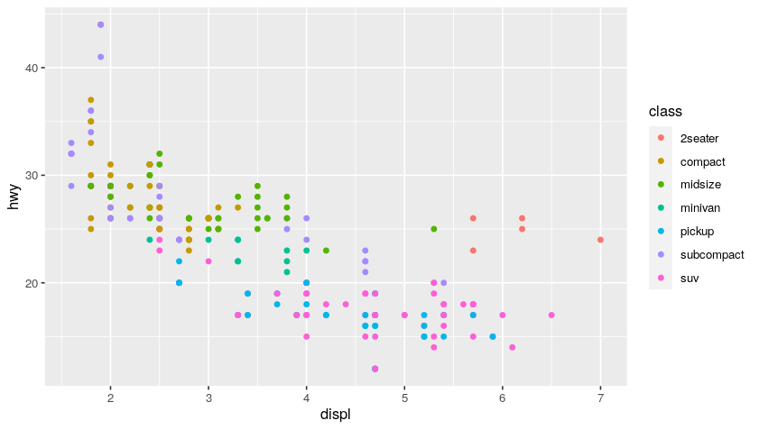

[R](https://www.r-project.org/) is a programming language for statistical computing and graphics supported by the R Core Team and the R Foundation for Statistical Computing. Created by statisticians Ross Ihaka and Robert Gentleman, R is used among data miners and statisticians for developing statistical software and data analysis.

[RStudio](https://www.rstudio.com/) provides free and open-source tools for R and enterprise-ready professional software for data science teams to develop and share their work.

Here, we show how to set up RStudio server via a Docker image on a local machine. Then, we run some basic commands to learn the R fundamentals.


<h2 id="contents"> Contents </h2>

- [Why R?](#why-r)
- [Setting up R and RStudio via Docker](#setting-up-r-and-rstudio-via-docker)
- [RStudio Interface and Markdown Scripts](#rstudio-interface-and-markdown-scripts)
- [Basic Syntax and Hotkeys](#basic-syntax-and-hotkeys)
- [Data Types and R objects](#data-types-and-r-objects)
  - [Vector](#vector)
  - [Lists](#lists)
  - [Matrices](#matrices)
  - [Arrays](#arrays)
  - [Factors](#factors)
  - [Data Frames](#data-frames)
- [Manage Data in R: tidyverse](#manage-data-in-r-tidyverse)
  - [The dplyr Package](#the-dplyr-package)
  - [%...% and Pipe Operators](#-and-pipe-operators)
  - [Clean and Re-shape with dplyr](#clean-and-re-shape-with-dplyr)
- [Plot Your Data: ggplot](#plot-your-data-ggplot)
- [Examples of EDA (Exploratory Data Analysis)](#examples-of-eda-exploratory-data-analysis)
- [Import Data from Your Files: readr](#import-data-from-your-files-readr)
- [Bonus: Useful Packages](#bonus-useful-packages)
  - [datapasta](#datapasta)
  - [esquisse](#esquisse)
  - [rayshader](#rayshader)
- [Resources](#resources)


## Why R?
[↑ back to contents ↑](#contents)

R can be used for a lot of different things. 
It's widely used in **data science** and **statistical research**.
With R, you can create a variety of different types of documents, reports, or any sort of analysis with R and its various packages and useful utilities.
You can also create dashboards with various packages like the [shiny](https://shiny.rstudio.com/) package, and it's widely used in academia for research. 

R is an **incredibly popular** language (check its positioning on the [TIOBE index](https://www.tiobe.com/tiobe-index/)), but why?
Despite the fact that it is a very specialized language for statistical analysis, data science, and academia, it is highly rated and broadly adopted.
Python is definitely a popular language for data science and academia, but R definitely has its place as a specialized language that works in a lot of areas, whereas python is more of a general-purpose language.

R was created in 1993 as an implementation of the [S language](https://en.wikipedia.org/wiki/S_(programming_language)) made at Bell labs in 1976.
That's the reason why R is a **mature** language and why it is **conservatively maintained**. 
The base package of R is very rarely changed, and updates are usually backward compatible.
So, changes to R rarely will break: if you can use some 20-years-old R code, it will probably still run!
R has an amazing wealth of code that's already been written and used for decades. Moreover R graphics using the [`ggplot2`](https://ggplot2.tidyverse.org/) package are used in modern journalism or scientific literature for a lot of the infographics and visualizations.
The con of such a strong legacy is that, since R is a very old language, it contains a lot of quirks, weird history, and things that have been left around.

R is **highly extensible** with its [package system](https://cran.r-project.org/). There are an incalculable number of packages, and more are being made every single day. 

R is a **vectorized language**. Hence, even single values are just vectors of size one. This gives you great power over what you can get out of these vectors, and it's easy to perform analysis and bulk operations.

R is really interesting because it does have elements of both **object-oriented** and **functional programming**. 

R is great as an interface or an **intermediary language** between other languages. There are a lot of other languages can integrate in R working closely with it, either reproducible analyses, creating a good-looking documents, or just improving speed. Since R is **single threaded**, for example, we can boost its calculation speed with some C++ code. R works well with latex and markdown as well, and with [pandoc](https://pandoc.org/) you can create really great documents. Javascript libraries come into play when you export R code to HTML documents, and so on...

## Setting up R and RStudio via Docker 
[↑ back to contents ↑](#contents)

The [Rocker Project](https://www.rocker-project.org/) is a great open-source project, and it allows us to easily set up our R development environment. 
If we have [Docker](https://docs.docker.com/installation/) installed, we can start R inside a container just with:
```
docker run --rm -ti rocker/r-base
```

If we want instead to get started with an RStudio® instance, we need to execute:
```
docker run -e PASSWORD=yourpassword --rm -p 8787:8787 rocker/rstudio
```
Then, we go at [localhost:8787](localhost:8787) and log in using user/password `rstudio`/`yourpassword`. 

> If a password is not provided, a randomly generated password will be given in the docker log for the container. 
> Check the terminal output or use `docker logs` command to check.


## RStudio Interface and Markdown Scripts
[↑ back to contents ↑](#contents)


After we go at [localhost:8787](localhost:8787) we find ourself in the RStudio web interface. The following windows will appear as part of it:
- **Console window**: it is the standard R console window (the only one you would see if you used only R and not R via RStudio. This is the window where you type in commands and the results are returned.
- **Workspace / History**: it shows all the objects that you have created in the current R session (Workspace tab) and the commands you have used in the current R session (History tab).
- **Files / Plots / Packages / Help**: it is primarily used for displaying plots (graphs) and for using the help system.

R is a **command driven program**, which means that you type in code to the Console window and it returns the result. You can either type code directly into the Console window, or you can type it into a **script file**, and then run the code you have written in the Console window.  To create a text file to write your code in select `File -> New File -> R Script`. Then, the RStudio user-interface will open:
- **Script window**: it allows you to write R code into the script file. 

A useful RStudio feature is to use [Markdown scripts](https://www.rstudio.com/wp-content/uploads/2015/02/rmarkdown-cheatsheet.pdf) (`.Rmd` extension), that are basically markdown documents with R code embedded in blocks:

<pre>
    ---
    title: "Hello R Markdown"
    author: "Awesome Me"
    date: "2018-02-14"
    output: html_document
    ---
    This is a paragraph in an R Markdown document.
    Below is a code chunk:
    ```{r}
    fit = lm(dist ~ speed, data = cars)
    b   = coef(fit)
    plot(cars)
    abline(fit)
    ```
    The slope of the regression is `r b[1]`.
</pre>

## Basic Syntax and Hotkeys
[↑ back to contents ↑](#contents)

A comprehensive list of RStudio hotkeys is available directly in the RStudio IDE under the Tools menu: `Tools -> Keyboard Shortcuts Help`.
The most common are:
- ``ctrl-enter`` execute selected lines / whole chunk
- ``ctrl-shift-C``: comment selected lines
- ``ctrl-L``: clear console log

An example code chuck is the following one:
```r
7         # this number will be displayed
x <- 1    # 1 will be assigned to x
2 -> y    # assignment can work the other way around as well
z = x + y # equal can be used as well for value assignment 
```
When the chunk is ran, the output displayed on the console is:
```
[1] 7
```

## Data Types and R objects
[↑ back to contents ↑](#contents)

In contrast to other programming languages like C and Java, in R the variables are not declared as some data type. 
The variables are assigned with R-Objects and the data type of the **R-object** becomes the data type of the variable. 
There are 6 types of objects in R Programming:
- Vectors
- Lists
- Matrices
- Arrays
- Factors
- Data Frames


### Vector
[↑ back to contents ↑](#contents)

Vectors are one of the basic R programming data objects. Everything's a vector. If you just assign a single value, it's a vector of length one. They are six types of atomic vectors:
  - `logical`
  - `integer`
  - `character`
  - `raw`
  - `double`
  - `complex`

Code:
```r
# Logical TRUE, FALSE 
v <- TRUE 
print(class(v))
# Numeric 12.3, 5, 999 
v <- 23.5
print(class(v))
# Integer 2L, 34L, 0L 
v <- 2L
print(class(v))
# Complex 3 + 2i 
v <- 2+5i
print(class(v))
# Character 'a', '"good", "TRUE", '23.4' 
v <- "TRUE"
print(class(v))
# Raw "Hello" is stored as 48 65 6c 6c 6f 
v <- charToRaw("Hello")
print(class(v))
v
```
Output:
```
[1] "logical"
[1] "numeric"
[1] "integer"
[1] "complex"
[1] "character"
[1] "raw"
[1] 48 65 6c 6c 6f
```

`c()` is a generic function which combines its arguments. 
The default method combines its arguments to form a vector. 
All arguments are coerced to a common type which is the type of the returned value, and all attributes except names are removed.

Code:
```r
# Create a vector.
apple <- c('red','green',"yellow")
print(apple)
# Get the class of the vector.
print(class(apple))
```
Output:
```
[1] "red"    "green"  "yellow"
[1] "character"
```

### Lists
[↑ back to contents ↑](#contents)

Lists are data objects of R that contain various types of elements including strings, numbers, vectors, and a nested list inside it. It can also consist of matrices or functions as elements. It can be created with the help of the `list()` function.

Code:
```r
# Create a list.
list1 <- list(c(2,5,3),21.3,sin, TRUE)
# Print the list.
print(list1)
```
Output:
```
[[1]]
[1] 2 5 3

[[2]]
[1] 21.3

[[3]]
function (x)  .Primitive("sin")

[[4]]
[1] TRUE
```


### Matrices
[↑ back to contents ↑](#contents)

Matrices in R Programming are used to arrange elements in the two-dimensional layout. They contain elements of the same data type. They usually contain numeric values in order to perform mathematical operations.

Code:
```r
# Create a matrix.
M = matrix( c('a','a','b','c','b','a'), nrow = 2, ncol = 3, byrow = TRUE)
print(M)
```
Output:
```
     [,1] [,2] [,3]
[1,] "a"  "a"  "b" 
[2,] "c"  "b"  "a" 
```


### Arrays
[↑ back to contents ↑](#contents)

An array is used to store data in more than just 2 dimensions. It is used to store multi-dimensional data in the required format. It can be created with the help of an `array()` function.

Code:
```r
# Create an array.
a <- array(c('green','yellow'),dim = c(3,3,2))
print(a)
```
Output:
```
, , 1

     [,1]     [,2]     [,3]    
[1,] "green"  "yellow" "green" 
[2,] "yellow" "green"  "yellow"
[3,] "green"  "yellow" "green" 

, , 2

     [,1]     [,2]     [,3]    
[1,] "yellow" "green"  "yellow"
[2,] "green"  "yellow" "green" 
[3,] "yellow" "green"  "yellow"
```

> ⚠️ **R Vector Recycling** is a process in which two vectors are involved in an operation, that operation needs the vectors to be of same length, and R repeats the elements of shorter vector to match the length of longer vector.
> 
>  This happens as well for `array()` functon. If you create - for example - an array from a vector of two values `c("green", "yellow")` and you set the array dimensions to `dim=(5)` R recycles the vector values in order to fill up the array: `[1] "green"  "yellow" "green"  "yellow" "green" `
> 
> If you have a vector that's too short, then, R will start repeating its values. If you want to avoid this behavior, you need to pay close attention to the length of your vectors and what you're doing with them!


### Factors
[↑ back to contents ↑](#contents)

Factors are the r-objects which are created using a vector. It stores the vector along with the distinct values of the elements in the vector as labels. The labels are always character irrespective of whether it is numeric or character or Boolean etc. in the input vector. They are useful in statistical modeling.

Factors are created using the `factor()` function. The `nlevels` functions gives the count of levels.

Code:
```r
# Create a vector.
apple_colors <- c('green','green','yellow','red','red','red','green')
# Create a factor object.
factor_apple <- factor(apple_colors)
# Print the factor.
print(factor_apple)
print(nlevels(factor_apple))
```

Output:
```
[1] green  green  yellow red    red    red    green 
Levels: green red yellow
[1] 3
```

### Data Frames
[↑ back to contents ↑](#contents)

Data frames are tabular data objects. Unlike a matrix in data frame each column can contain different modes of data (e.g. the first column can be numeric while the second column can be character and third column can be logical). A data frame is basically is a list of vectors of equal length. 

Data Frames are created using the `data.frame()` function, and all the columns need to contain the same number of rows (hence, be careful about vector recycling).

Code:
```r
# Create the data frame.
BMI <-  data.frame(
   name = c("John", "Jill","Mark"),
   gender = factor(c("Male", "Male","Female")), 
   height = c(152, 171.5, 165), 
   weight = c(81,93, 78),
   Age = c(42,38,26)
)
print(BMI)
```

Output:
```
  name gender height weight Age
1 John   Male  152.0     81  42
2 Jill   Male  171.5     93  38
3 Mark Female  165.0     78  26
```

## Manage Data in R: tidyverse
[↑ back to contents ↑](#contents)

> There is actually a lot of debate if one should actually learn how to use the tidyverse in the beginning. Indeed, working with it does not allow you to learn about many problems of R that have been fixed by tidyverse workarounds. Regarding this R inferno, there is a full [book](https://www.burns-stat.com/pages/Tutor/R_inferno.pdf) about it.

Within the package system of R, there is a ecosystem called [tidyverse](https://www.tidyverse.org/). 
The tidyverse is an opinionated collection of R packages designed for data science. 
All packages share an underlying design philosophy, grammar, and data structures.

When you install it with `install.packages("tidyverse",dependencies = TRUE)` and import it with `library(tidyverse)`, you import a group of packages that all work together using what is called a **tidy data** format:

> _«Tidy datasets are easy to manipulate, model and visualise, and have a specific structure: each variable is a column, each observation is a row, and each type of observational unit is a table. This framework makes it easy to tidy messy datasets because only a small set of tools are needed to deal with a wide range of un-tidy datasets. This structure also makes it easier to develop tidy tools for data analysis, tools that both input and output tidy datasets. The advantages of a consistent data structure and matching tools are demonstrated with a case study free from mundane data manipulation chores.»_
> 
> From [Hadley Wickham, **Tidy data.**, _The Journal of Statistical Software_, vol. 59, 2014](https://vita.had.co.nz/papers/tidy-data.html).
> Check out the corresponding [Tidyverse Article](https://tidyr.tidyverse.org/articles/tidy-data.html) as well.


### The dplyr Package
[↑ back to contents ↑](#contents)

A very useful package in the tidyverse for managing data is called [dplyr](https://dplyr.tidyverse.org/). 
`dplyr` is a grammar of data manipulation, providing a **consistent set of verbs** that help you solve the most common data manipulation challenges:
- `mutate()` adds new variables that are functions of existing variables
- `select()` picks variables based on their names
- `filter()` picks cases based on their values
- `summarise()` reduces multiple values down to a single summary
- `arrange()` changes the ordering of the rows

These all combine naturally with `group_by()` which allows you to perform any operation "by group". 
You can learn more about them in `vignette("dplyr")`. 
As well as these single-table verbs, `dplyr` also provides a variety of two-table verbs, which you can learn about in `vignette("two-table")`.

> The best place to start learning about dplyr is the [data transformation chapter](https://r4ds.had.co.nz/transform.html) in the [R for data science](https://r4ds.had.co.nz/index.html) book.

We can load sample data with the `mpg` command. This command loads the MPG (MilesPerGallon) dataframe containing observations collected by the US Environment Protection Agency on 38 models of cars. These observations provides fuel economy data from 1999 and 2008.

Code:
```r
library(tidyverse)
mpg
```

Output:
```
# A tibble: 234 × 11
   manufacturer model      displ  year   cyl trans      drv     cty   hwy fl    class  
   <chr>        <chr>      <dbl> <int> <int> <chr>      <chr> <int> <int> <chr> <chr>  
 1 audi         a4           1.8  1999     4 auto(l5)   f        18    29 p     compact
 2 audi         a4           1.8  1999     4 manual(m5) f        21    29 p     compact
 3 audi         a4           2    2008     4 manual(m6) f        20    31 p     compact
 4 audi         a4           2    2008     4 auto(av)   f        21    30 p     compact
 5 audi         a4           2.8  1999     6 auto(l5)   f        16    26 p     compact
 6 audi         a4           2.8  1999     6 manual(m5) f        18    26 p     compact
 7 audi         a4           3.1  2008     6 auto(av)   f        18    27 p     compact
 8 audi         a4 quattro   1.8  1999     4 manual(m5) 4        18    26 p     compact
 9 audi         a4 quattro   1.8  1999     4 auto(l5)   4        16    25 p     compact
10 audi         a4 quattro   2    2008     4 manual(m6) 4        20    28 p     compact
# … with 224 more rows
```

> Check out what a `tibble` and a `tribble` are the [Tibbles chapter](https://r4ds.had.co.nz/tibbles.html) in [R for data science](https://r4ds.had.co.nz/).

Since we are  with a built-in dataset is that documentation giving further descriptions and explanations is available via the help page:
```r
?mpg
```


### %...% and Pipe Operators
[↑ back to contents ↑](#contents)

A very useful command in `Dplyr` is the [pipe operator](https://towardsdatascience.com/an-introduction-to-the-pipe-in-r-823090760d64) `%>%`. 
The pipe operator, written as `%>%`, has been a longstanding feature of the `magrittr` package for R. 
It takes the output of one function and passes it into another function as an argument. 
This allows us to **link a sequence of analysis steps**.

> To visualise this process, imagine a factory with different machines placed along a conveyor belt. Each machine is a function that performs a stage of our analysis, like filtering or transforming data. The pipe therefore works like a conveyor belt, transporting the output of one machine to another for further processing.

In order to understand how it works, we need to know first what the `%...%` operators mean in R. Indeed, `%>%` has no builtin meaning but the user (or a package) is free to define operators of the form `%whatever%` in any way they like. For example, this function will return a string consisting of its left argument followed by a comma and space and then it's right argument:
```r
"%,%" <- function(x, y) paste0(x, ", ", y)
# test run
"Hello" %,% "World"
```
Output:
```
[1] "Hello, World"
```

Regarding common `%...% ` operators:
- The base of R provides
  - `%*%` (matrix mulitiplication)
  - `%/%` (integer division)
  - `%in%` (is lhs a component of the rhs?)
  - `%o%` (outer product) 
  - `%x%` (kronecker product) 
  - It is not clear whether `%%` falls in this category or not, but it represents modulo.
- The `expm` package defines
  - `%^%` a matrix power operator
- The `operators` package defines a large number of such operators such as
  - `%!in%` (for not `%in%`)
  - see http://cran.r-project.org/web/packages/operators/operators.pdf for more...
- The `igraph` package defines
  -  `%--%` , `%->%` and `%<-%` to select edges
- The `lubridate` package defines
  - `%m+%` and `%m-%` to add and subtract months
  - `%--%` to define an interval

Regarding the **pipe operators**:
- the `magrittr` package defined `%>%` as discussed in the [magrittr vignette](http://cran.r-project.org/web/packages/magrittr/vignettes/magrittr.html).
- the `dplyr` package used to define a (now deprecated) `%.%` operator which is similar (check [this](https://stackoverflow.com/questions/23621209/differences-between-dplyr-and-magrittr) for further details). However, now `dplyr` imports `%>%` from `magrittr` making it available to the user.
- the `pipeR` package, defines a `%>>%` operator that is similar to magrittr's `%>%` and can be used as an alternative to it (see http://renkun.me/pipeR-tutorial/)
- the `postlogic` package defined `%if%` and `%unless%` operators.
- the `wrapr` package defines a dot pipe `%.>%` that is an explicit version of `%>%` in that it does not do implicit insertion of arguments but only substitutes explicit uses of dot on the right hand side. This can be considered as another alternative to `%>%` (see https://winvector.github.io/wrapr/articles/dot_pipe.html)
- the development version of R has defined a `|>` pipe. Unlike `magrittr`'s `%>%` it can only substitute into the first argument of the right hand side. Although limited, it works via syntax transformation so it has no performance impact.

### Clean and Re-shape with dplyr
[↑ back to contents ↑](#contents)

Now that we know what the pipe operator `%>%` does in `dplyr`, we can see how to concatenate `dplyr` functions in order to clean and reshape our data.

Code:
```r
mpg %>% 
  # "filter" - return all rows that satisfy conditions
  dplyr::filter(
      model == 'a4', # filter only a4 models
  ) %>% 
  # "arrange" - reorder your rows
  dplyr::arrange(
      displ, cyl, # reorder by "displ", then by "cyl"
  ) %>%
  # "mutate" - add column preserving all the other ones
  dplyr::mutate(
    old = year < 2000, # add a "old" column that is true if "year" is before 2000
    full_wheel_drive = drv == 'f', # add a "full_wheel_drive" column
  ) %>%
  # "select" - choose columns to keep or remove
  dplyr::select(
      -drv # remove "full_wheel_drive"
  )
```
Output:
```
A tibble: 7 × 12
  manufacturer model displ  year   cyl trans        cty   hwy fl    class   old   full_wheel_drive
  <chr>        <chr> <dbl> <int> <int> <chr>      <int> <int> <chr> <chr>   <lgl> <lgl>           
1 audi         a4      1.8  1999     4 auto(l5)      18    29 p     compact TRUE  TRUE            
2 audi         a4      1.8  1999     4 manual(m5)    21    29 p     compact TRUE  TRUE            
3 audi         a4      2    2008     4 manual(m6)    20    31 p     compact FALSE TRUE            
4 audi         a4      2    2008     4 auto(av)      21    30 p     compact FALSE TRUE            
5 audi         a4      2.8  1999     6 auto(l5)      16    26 p     compact TRUE  TRUE            
6 audi         a4      2.8  1999     6 manual(m5)    18    26 p     compact TRUE  TRUE            
7 audi         a4      3.1  2008     6 auto(av)      18    27 p     compact FALSE TRUE            
```

The `dplyr` package allows us to aggregate data as well.

Code:
```r
mpg %>%   
  # create aggregate stats and sort
  dplyr::count(model,sort = TRUE) %>% 
  # select only more than 8 counts
  dplyr::filter(n > 8)
```

Output:
```
  model                   n
  <chr>               <int>
1 caravan 2wd            11
2 ram 1500 pickup 4wd    10
3 civic                   9
4 dakota pickup 4wd       9
5 jetta                   9
6 mustang                 9
```


## Plot Your Data: ggplot
[↑ back to contents ↑](#contents)

Probably one of the most if not the most popular package in R is the [ggplot2](https://ggplot2.tidyverse.org/) package.
`ggplot` is a system for declaratively creating graphics, based on [The Grammar of Graphics](https://www.amazon.com/Grammar-Graphics-Statistics-Computing/dp/0387245448/ref=as_li_ss_tl) ("gg" stands for Grammar of Graphics). 
With `ggplot` You provide the data, tell `ggplot` how to map variables to aesthetics, what graphical primitives to use, and it takes care of the details.

`ggplot` it is used all over the world by high-level academics, and PhDs, but also a lot of journalism reports use `ggplot` and R to actually create complex, highly detailed, and visually appealing visualizations.  

> A ggplot specific characteristic which is likely not going to change (until an eventual future iteration "ggplot3" if it ever happens) is that Hadley Wickham created this package before he discovered the pipe operator. So, **we can't just pipe ggplot into the next function**. That is the reason why we use **instead  the plus operator** to carry on to the next action. 


Code:
```r
ggplot(data = mpg) # make a ggplot with the mpg dataframe (without any layer, it is still a white canvas)
    + geom_point( # add a geom_point layer, i.e., a scatter plot
        mapping = aes( # "aes" means "aesthetic", it states how to color/stylize/... the geom_point
            x = displ, y = hwy # scatter point mapping to the dataframe
        )
    )

ggplot(data = mpg) 
    + geom_point(
        mapping = aes(
            x = displ, y = hwy, 
            color = class # add color classes to the scatter points
        )
    )
```
Plot:
<div class="text-center">
    
    
</div>
 
You can use multiple geoms on a single chart and this is how you create very robust visualizations. Basically, it is like adding a layer of paint over your blank ggplot canvas using additional criteria and keep layering on that paint until you get an interesting visualization.

Code:
```r
ggplot(data = mpg) + 
  geom_point(mapping = aes(x = displ, y = hwy)) + 
  facet_wrap(~ class, nrow = 2) # facet graph based on class

ggplot(data = mpg) + 
  geom_point(mapping = aes(x = displ, y = hwy)) + 
  facet_grid(drv ~ cyl) # facet grid based on (drv, cyl) pairs
```
Plot:
<div class="text-center">
    
    
</div>

Code:
```r
# aestetic mapping in ggplot common to all geom_
ggplot(data = mpg, mapping = aes(x = displ, y = hwy)) + 
  geom_point() +  # no more mapping (using the one defined up here)
  geom_smooth()   # no more mapping (using the one defined up here)

ggplot(data = mpg, mapping = aes(x = displ, y = hwy)) + 
  geom_point(mapping = aes(color = class)) +  # add coloring by class mapping
  geom_smooth()
```
Plot:
<div class="text-center">
    
    
</div>


## Examples of EDA (Exploratory Data Analysis)
[↑ back to contents ↑](#contents)

Exploratory Data Analysis refers to the critical process of performing initial investigations on data so as to discover patterns,to spot anomalies,to test hypothesis and to check assumptions with the help of summary statistics and graphical representations. 

Let's consider for this case a different dataset:

```r
diamonds
```

Output:
```
# A tibble: 53,940 × 10
   carat cut       color clarity depth table price     x     y     z
   <dbl> <ord>     <ord> <ord>   <dbl> <dbl> <int> <dbl> <dbl> <dbl>
 1  0.23 Ideal     E     SI2      61.5    55   326  3.95  3.98  2.43
 2  0.21 Premium   E     SI1      59.8    61   326  3.89  3.84  2.31
 3  0.23 Good      E     VS1      56.9    65   327  4.05  4.07  2.31
 4  0.29 Premium   I     VS2      62.4    58   334  4.2   4.23  2.63
 5  0.31 Good      J     SI2      63.3    58   335  4.34  4.35  2.75
 6  0.24 Very Good J     VVS2     62.8    57   336  3.94  3.96  2.48
 7  0.24 Very Good I     VVS1     62.3    57   336  3.95  3.98  2.47
 8  0.26 Very Good H     SI1      61.9    55   337  4.07  4.11  2.53
 9  0.22 Fair      E     VS2      65.1    61   337  3.87  3.78  2.49
10  0.23 Very Good H     VS1      59.4    61   338  4     4.05  2.39
# … with 53,930 more rows
```

Since we are  with a built-in dataset is that documentation giving further descriptions and explanations is available via the help page:
```r
?diamonds
```

We can start by plotting a bar chart of the diamond cuts:

```r
# bar chart on diamonds dataset
ggplot(data = diamonds) + 
  geom_bar(mapping = aes(x = cut))
```
Plot:
<div class="text-center">
    
</div>

We can now filter, for example, based on the diamond carats:

```r
count(diamonds)

# the variable "smaller" receives the output of 
#  the diamonds being filtered with carat < 3,
#  hence "smaller" is true when carat < 3
smaller <- diamonds %>% 
  filter(carat < 3)

count(smaller)
```
Output:
```
# A tibble: 1 × 1
      n
  <int>
1 53940

# A tibble: 1 × 1
      n
  <int>
1 53900
```

Hence, we have only 40 diamonds with more than 2 carats.
Now, using our original `diamonds` dataset, we can plot the histogram distributions with bin of 0.2 and 0.5:
```r
ggplot(data = diamonds, mapping = aes(x = carat)) +
  geom_histogram(binwidth = 0.2)

ggplot(data = diamonds, mapping = aes(x = carat)) +
  geom_histogram(binwidth = 0.5)
```
Plot:
<div class="text-center">
    
    
</div>

So, from this distribution, we understand that we have a lot of diamonds with low carats. 

We can then create a boxplot in order to study further such data. For example, we can see how the carats distribution behaves cut-wise:

```r
ggplot(data = diamonds) +
  geom_boxplot(
    mapping = aes(
      x = reorder(cut, carat, FUN = median), 
      y = carat
    )
  )
```
Plot:
<div class="text-center">
    
</div>

In the box plot, all the dots are the outliers, while the boxes represent the median and the inner-quarter ranges.

We can as well countd diamonds by color and cut, and then sort the results:
```r
diamonds %>% 
  count(color, cut, sort = T)  # (T is TRUE)
```
Output:
```
# A tibble: 35 × 3
   color cut           n
   <ord> <ord>     <int>
 1 G     Ideal      4884
 2 E     Ideal      3903
 3 F     Ideal      3826
 4 H     Ideal      3115
 5 G     Premium    2924
 6 D     Ideal      2834
 7 E     Very Good  2400
 8 H     Premium    2360
 9 E     Premium    2337
10 F     Premium    2331
# … with 25 more rows
```

We can then rearrange such output in a more "aesthetic" way by using a heatmap:
```r
diamonds %>% 
  count(color, cut, sort = T) %>%  
  ggplot(mapping = aes(x = color, y = cut)) + 
  geom_tile(mapping = aes(fill = n))
```
Plot:
<div class="text-center">
    
</div>

## Import Data from Your Files: readr
[↑ back to contents ↑](#contents)

A very simple and handy data format for tabular data is CSV. The goal of the `readr` package is to provide a fast and friendly way to read rectangular data (like CSV, TSB, and FWF). It is designed to flexibly parse many types of data found in the wild, while still cleanly failing when data unexpectedly changes.

Import a csv into an R dataframe with `readr` is pretty simple:
```r
library(readr)
data <- read_csv("path/to/data.csv")
```

> The best place to start knowing `readr` is the [data import chapter](https://r4ds.had.co.nz/data-import.html) in [R for data science](https://r4ds.had.co.nz/).


## Bonus: Useful Packages
[↑ back to contents ↑](#contents)

Here, we just report some really cool and simple packages madea available in R.

### datapasta
[↑ back to contents ↑](#contents)

[`datapasta`](https://milesmcbain.github.io/datapasta/) is about reducing resistance associated with copying and pasting data to and from R.  It allows you to quickly copy from data (even html tables on websites!)

### esquisse
[↑ back to contents ↑](#contents)

[`esquisse`](https://dreamrs.github.io/esquisse/) allow you to interactively explore your data by visualizing it with the `ggplot2` package. It allows you to draw bar plots, curves, scatter plots, histograms, boxplot and sf objects, then export the graph or retrieve the code to reproduce the graph.

```r
install.packages("esquisse")
```

After installing it you can find `esquisse` in the add-ins menu:

<div class="text-center">
    
</div>

Then you can use the ggplot2 builder to select a dataset, build complex plots, and automatically generate the necessary R code. For example:

```r
library(esquisse)
library(ggplot2)

ggplot(diamonds) +
    aes(x = carat, y = price) +
    geom_point(size = 1L, colour = "#26828e") +
    geom_smooth(span = 0.75) +
    labs(x = "carat", y = "price", title = "heres my title", subtitle = "a view of diamonds", caption = "hello caption") +
    theme_minimal()
```
Plot:
<div class="text-center">
    
</div>


### rayshader
[↑ back to contents ↑](#contents)

[`rayshader`](https://www.rayshader.com/) is an open source package for producing 2D and 3D data visualizations in R. `rayshader` uses elevation data in a base R matrix and a combination of raytracing, spherical texture mapping, overlays, and ambient occlusion to generate beautiful topographic 2D and 3D maps. In addition to maps, `rayshader` also allows the user to translate `ggplot2` objects into beautiful 3D data visualizations.

The models can be rotated and examined interactively or the camera movement can be scripted to create animations. Scenes can also be rendered using a high-quality pathtracer, **rayrender**.The user can also create a cinematic depth of field post-processing effect to direct the user’s focus to important regions in the figure. The 3D models can also be exported to a 3D-printable format with a built-in STL export function


## Resources 
[↑ back to contents ↑](#contents)

- [Site \| R Project](https://www.r-project.org/)
- [Site \| RStudio](https://www.rstudio.com/)  
- [Site \| The Rocker Project](https://www.rocker-project.org/)
- [Book \| R for Data Science](https://r4ds.had.co.nz/index.html)
- [Book \| R Markdown: The Definitive Guide](https://bookdown.org/yihui/rmarkdown/)
- [Book \| Advanced R](https://adv-r.hadley.nz/)
- [Book \| R Inferno](https://www.burns-stat.com/pages/Tutor/R_inferno.pdf)
- [Blog \| An Introduction to the Pipe Operator](https://towardsdatascience.com/an-introduction-to-the-pipe-in-r-823090760d64)
- [Cheatsheet \| R Markdown](https://www.rstudio.com/wp-content/uploads/2015/02/rmarkdown-cheatsheet.pdf)
- [Cheatsheet \| ggplot2](https://github.com/rstudio/cheatsheets/blob/main/data-visualization-2.1.pdf)
- [YouTube \| R Programming Crash Course](https://www.youtube.com/watch?v=ZYdXI1GteDE)
